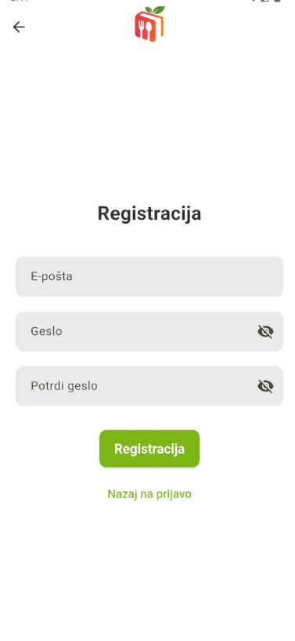
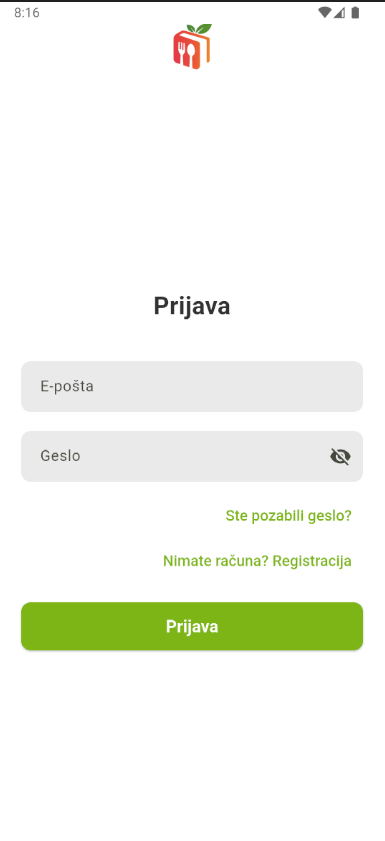
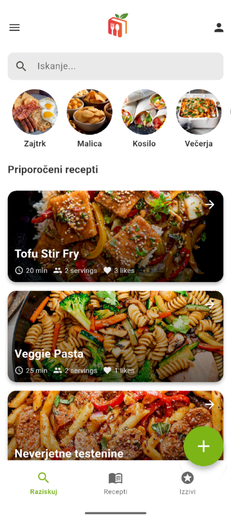
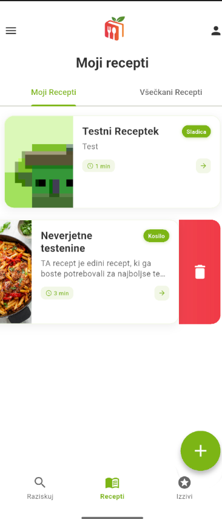

# 🍽️ DishDash

**DishDash** je sodobna mobilna aplikacija, razvita z uporabo **Flutter** in povezano z **Supabase**. Namenjena je vsem ljubiteljem kuhanja, ki želijo enostavno **odkrivati, deliti in organizirati recepte** ter se povezovati z globalno kuharsko skupnostjo.

---

## 👥 Člani ekipe

| Ime in Priimek       | E-naslov                          | Izobrazba                              |
|----------------------|-----------------------------------|----------------------------------------|
| **Benjamin Jeran**   | benjamin.jeran@student.um.si      | dipl. inž. inf. in tehnol. kom. (VS)   |
| **Alen Šaruga**      | alen.saruga@student.um.si         | dipl. inž. inf. in tehnol. kom. (VS)   |
| **Miha Klančnik**    | miha.klancnik@student.um.si       | dipl. inž. inf. in tehnol. kom. (VS)   |

---

## 📋 Vzpostavitvena dokumentacija

### 🔧 Predpogoji
Za uspešen zagon in razvoj projekta **DishDash** potrebuješ:
- **Flutter SDK** 
- **Dart SDK**
- **Supabase račun** (v primeru, da želiš imeti svojo podatkovno bazo)
- **Git** (za upravljanje verzij)
- **Android Studio** ali **VS Code** (za razvojno okolje)
- **Android emulator** ali **Fizično napravo**

### 🛠️ Namestitev in nastavitev
1. **Kloniraj repozitorij:**
   ```bash
   git clone https://github.com/BenjaminJeran/dish_dash.git
   cd dishdash
   ```
2. **Namesti odvisnosti:**
   ```bash
   flutter pub get
   ```
3. **Nastavi Supabase:**
   - Ustvari nov projekt na [Supabase](https://supabase.com/) ali uporabi obstoječega
   - V datoteki `.env` nastavi `SUPABASE_URL` in `ANON_KEY` ali uporabi obstoječega
4. **Zaženi aplikacijo:**
   ```bash
   flutter run
   ```

### 📝 Dodatne informacije
- Za reševanje težav glede Flutterja obišči [Flutter Docs](https://docs.flutter.dev/).
- Za pomoč pri Supabase obišči [Supabase Docs](https://supabase.com/docs).

## 💡 Ideja in koncept

### 📱 Ime mobilne rešitve
**DishDash**

### 🧠 Opis ideje
Inovativna mobilna aplikacija, ki omogoča enostavno **deljenje, odkrivanje in preizkušanje receptov**. Uporabniki ustvarijo svojo kuharsko zbirko, se povežejo z drugimi ter raziskujejo svetovno kulinariko.

### ❗ Težava, ki jo rešujemo
Večina obstoječih aplikacij ni dovolj intuitivnih in ne ponuja naprednih funkcij za organizacijo, prilagajanje ali skupnostno izkušnjo.

---

## 🔍 Analiza konkurence

| Aplikacija | Prednosti | Pomanjkljivosti |
|-----------|-----------|----------------|
| Tasty     | Velika baza receptov | Omejene možnosti prilagajanja |
| SideChef  | Video vodiči | Kompleksen vmesnik |
| Cookpad   | Aktivna skupnost | Slabo urejeni nakupovalni seznami |

---

## 🎯 Cilji rešitve

- ✅ Enostavno ustvarjanje in deljenje receptov
- 💬 Interakcija z uporabniki (komentarji, ocene, shranjevanje)
- 🛒 Pameten nakupovalni seznam
- 🧠 Personalizirana priporočila
- 🏆 Kuharski izzivi in tekmovanja

---

## 👤 Ciljni uporabniki

- 👩‍🍳 Domači kuharji
- 🥗 Ljubitelji zdrave prehrane
- 🎬 Kulinarični vplivneži
- 👨‍👩‍👧‍👦 Družine
- 🌍 Globalni gurmani

---
## 🧩 Ključne funkcionalnosti

**DishDash** ponuja naslednje funkcionalnosti

1. **🔑 Prijava** – Uporabniki se lahko prijavljajo v svoj račun z e-naslovom in geslom.
2. **📝 Registracija** – Enostaven postopek za ustvarjanje novega uporabniškega računa z osnovnimi podatki.
3. **❤️ Všečkanje** – Možnost označbe receptov kot priljubljenih za hitrejši dostop kasneje.
4. **📖 Pregled receptov** – Raziskovanje receptov po kategorijah, oceni ali popularnosti.
5. **➕ Dodajanje/✏️ Urejanje/❌ Brisanje receptov** – Uporabniki lahko ustvarjajo, spreminjajo in odstranjujejo lastne recepte.
6. **🏆 Kuharski izzivi** – Sodelovanje v tematskih izzivih 
7. **⚙️ Nastavljanje preferenc** – Personalizacija priporočil glede na okuse, prehranske navade in alergene.
8. **🔍 Filtriranje receptov** – Iskanje receptov po preferencah, tipu hrane
9. **👤 Urejanje uporabniškega profila** – Spreminjanje osebnih podatkov, profilske slike in nastavitev računa.
10. **💬 Komentiranje receptov** – Pisanje in branje komentarjev pod recepti za izmenjavo mnenj in nasvetov.


## 📚 Uporabni viri

- 📘 [Flutter Dokumentacija](https://docs.flutter.dev/)
- 🗃️ [Supabase Dokumentacija](https://supabase.com/docs)
- 🧑‍🍳 [Flutter Cookbook](https://docs.flutter.dev/cookbook)
- 🚀 [Tvoj prvi Flutter projekt](https://docs.flutter.dev/get-started/codelab)


## 🖼️ Posnetki zaslona aplikacije

Spodaj so predstavljeni nekateri ključni zasloni aplikacije **DishDash**, ki prikazujejo njeno uporabniško izkušnjo in funkcionalnosti.

| Zaslon               | Opis                                                                 | Predogled                            |
|----------------------|----------------------------------------------------------------------|---------------------------------------|
| **Prijava**          | Uporabnik se prijavi v svoj račun za dostop do personaliziranih funkcij. |      |
| **Registracija**     | Hiter in enostaven postopek za ustvarjanje novega uporabniškega računa. |  |
| **Raziskovanje receptov** | Glavna stran za odkrivanje raznolikih receptov iz celega sveta.       |  |
| **Moji recepti**      | Pregled osebne zbirke receptov, ki jih je uporabnik ustvaril ali shranil. |  |
| **Kuharski izzivi**   | Vmesnik za sodelovanje v kulinaričnih izzivih in povezovanje s skupnostjo. |        |
